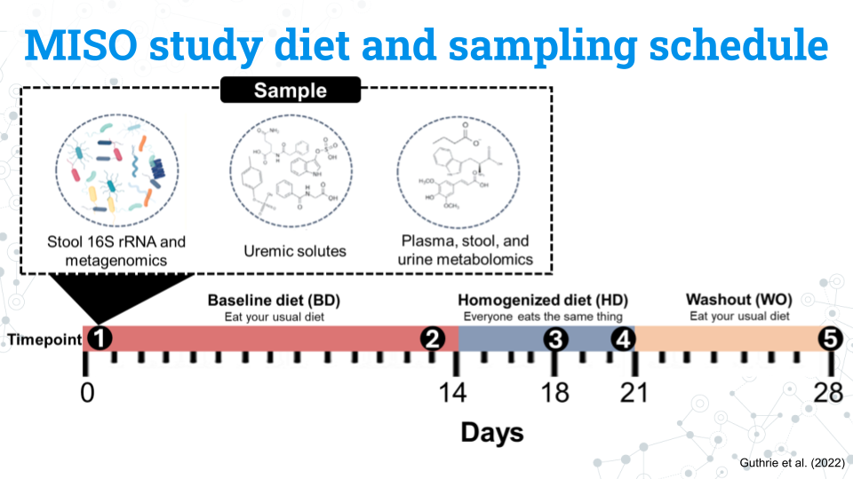
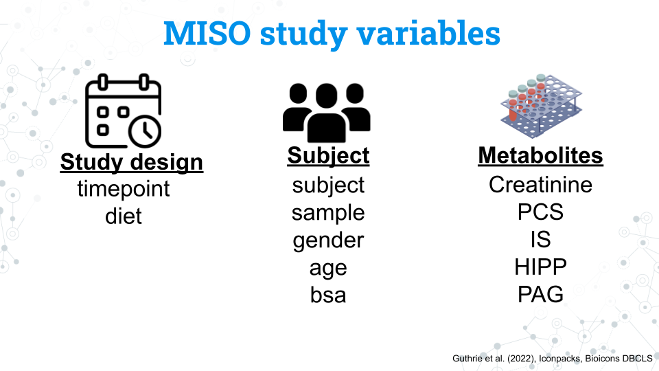
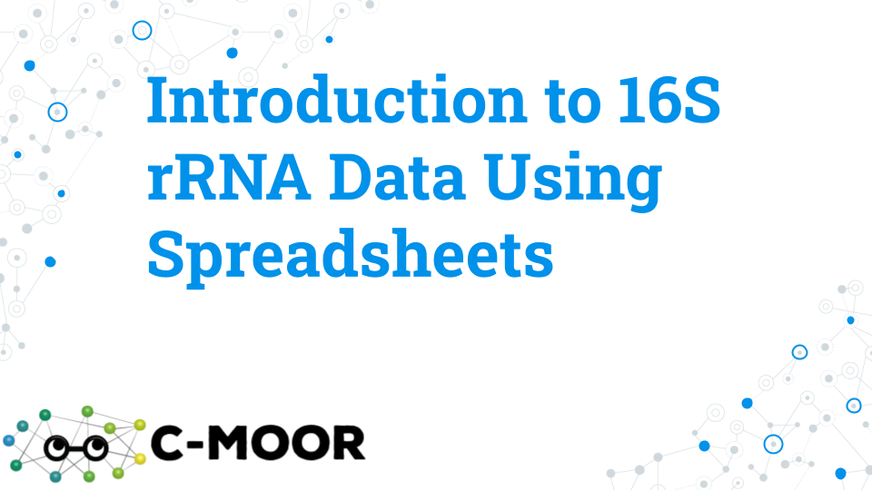

# (PART\*) Testing Ideas {-}

<!-- Set up code of OTTR Book-->

# 16S rRNA Data in spreadsheets 

## Meet the MISO study

Let's get prepared to do some research using 16S rRNA data! In this section, we'll be exploring data from *Impact of a 7-day homogeneous diet on interpersonal variation in human gut microbiomes and metabolomes* by Guthrie et al. (2022). This study is one of many that explores the relationship between diet and the human gut microbiome and will help familiarize us with the format that 16S rRNA data takes. We'll start slow and look at just a few lines of data in Google Sheets and then use phyloseq and DESeq2 in R to take our analysis to the next level.

Human diet has been implicated heavily in the establishment and maintenance of the gut microbiome. For example, human babies undergo a drastic change in the gut microbiome following the transition to solid food.

<!-- REFs: Xu et al. (2015) -->

It's difficult to capture the mechanisms and effects of diet on the gut microbiome given the sheer number of variables involved. The microbiome individuality and stability over time (MISO) study aimed to explore the connection between diet, microbiome, and metabolites by looking at the effect of feeding a standardized diet to people over 7 days. 

### MISO study diet and sampling schedule

The figure above shows the study design for the MISO study. You do not need to memorize all these details; feel free to refer to this page throughout the project:

- Participants eat their usual, **baseline diet (BD) for 14 days**
- Participants all eat the same diet, the **homogenized diet (HD), for 7 days**
- Participants return to their usual diet during the **washout (WO) period for 7 days**

The study lasts a total of 28 days. Samples from the blood, stool, and urine, our metabolite and 16S rRNA data are taken at 5 different timepoints:

- **Timepoint 1:** Day 0 (the start of the study)
- **Timepoint 2:** Day 13
- **Timepoint 3:** Day 17
- **Timepoint 4:** Day 21
- **Timepoint 5:** Day 28

### MISO study variables and factors

We have a number of variables we can use in our analysis. Notice that the variables for the study and subjects are in lowercase. This is also how you will access these variables in R.

#### Study design variables

<!-- How to align table using this format? -->

|Variable|What is it?|Factors|
|:----|--------------|----:|
|timepoint|The 5 samplings that occur on days 0, 13, 17, 21, and 28 coded as timepoints 1 through 5|1, 2, 3, 4, 5| 
|diet|The diet the subject was on during the sampling|BD, HD, WO|

#### Subject variables

|Variable|What is it?|Factors|
|:-|----|----:|
|subject|A unique ID given to each subject (participant)|S## (ex. S02 is subject 2. Note that while there are a total of 21 subjects in the study, but their subject numbers are not 1 through 20| 
|sample|A unique ID given to every sample taken during the study that includes the subject and timepoint of the sample|MISO-Subject##-Sample# (ex. MISO1-S02-1 is the sample from subject 2 at timepoint 1)|
|gender|The gender of the subject|M, F. All subjects were cisgender| 
|age|The age in years of the subject|A continuous variable from 23 to 75 years old| 
|bsa|Body surface area; a measure of body size|A continuous variable from 1.6 to 2.8| 

#### Metabolite variables

|Variable|What is it?|Factors|
|:----|--------------|----:|
|Creatinine|Creatinine|A continuous variable from 1072 to 3971| 
|PCS|*p*-cresol sulfate|A continuous variable from 2 to 95|
|IS|Indoxyl sulfate|A continuous variable from 3 to 58| 
|HIPP|Hippuric acid|A continuous variable from 16 to 1119| 
|PAG|Phenylacetylglutamine|A continuous variable from 16 to 318| 

### Amplicon sequence variants (ASVs) data

Finally we have our microbe count data, or our *Amplicon Sequence Variants (ASVs)*. Each ASV is a unique sequences that differs by as little as a single nucleotide from other ASVs and represents a specific microbe. We have assigned taxonomy to these microbes, but not all microbes have taxonomic data through the species level. These missing fields will appear as NA in the data.

You may see the word Operational Taxonomic Unit (OTU) in phyloseq and in other published studies. **ASVs and OTUs have some differences between them but they both represent distinct units of microbial taxa**, although they have some key differences. 

Each sample is associated with a count of each ASV. We can compare the counts of these ASVs between samples to determine differences in the composition of the microbiome between samples.

### Footnotes

#### Resources

#### Contributions and affiliations

- Sayumi York, Notre Dame of Maryland University

## Exploring 16S rRNA data in spreadsheets

In this section we will look at 16S data in a spreadsheet via Google Sheets. We will familiarize ourselves with the format of 16S data and manipulate just a few ASVs to better understand what kinds of research questions we can ask with the data. Through this exercise we will also come to understand the necessity of more powerful analysis tools in R; sorting through trends in a spreadsheet could take years!

## Lecture - Introducing 16S rRNA Data Using Spreadsheets

*Estimated time: *

[Lecture](https://docs.google.com/presentation/d/14E26SbzaLEDJxAaZ1qjaZcJehAI8q2GHuTokNPKKDTc/edit?usp=sharing)

## Activity - Introducing 16S rRNA Data Using Spreadsheets 

### Purpose

To explore bacterial diversity based on 16S rRNA gene sequencing using data from the “Impact of a 7-day homogeneous diet on interpersonal variation in human gut microbiomes and metabolomes” by Guthrie et al., 2023. This study is also referred to as the MISO study for  “Microbiome Individuality and Stability Over Time” because the study aims to understand variation (or stability) of microbiomes in individuals.

This spreadsheet activity aims to orient you towards understanding the data and metadata content of this study. In subsequent activities, you will explore and analyze this data using the R/Bioconductor package phyloseq. Google Sheets and R are both useful for doing different analyses, so keep in mind the tools at your disposal and what will be the most efficient way to answer your research questions. 

**Please note that this activity takes place in Google Sheets.** It is possible to do the same analysis in Microsoft Excel although the individual steps you will take are different. To help make things easier for everyone, we strongly recommend everyone uses Google Sheets; all our instructions will be specific to Sheets. Students who do not have a Google-associated email address can sign up for a free Gmail account and gain access to Google Sheets this way. 

**A Google Sheets cheatsheet that covers the necessary steps for this activity is available in our [Spreadsheets 101](https://science.c-moor.org/miniCURE-16S-Microbiome/spreadsheets-101.html) guide.** Students who are not experienced using spreadsheet software should note that the instructions build on prior steps. 

### Learning objectives

1. Explore Amplicon Sequence Variants (ASVs) through the taxonomy profile of select ASVs, and sample metadata for a subset of ASVs.
1. Ask research questions based on data and metadata
  - How many different microbes (ASVs) are there in a given sample?
  - Is there an even abundance of microbes (ASVs) in a sample or are there a few that dominate?
  - How varied are ASVs and their abundance across subjects?
  - How varied are ASVs and their abundance across diets?

### Introduction
The most popular sequencing technique for the analysis of bacterial diversity is targeted sequencing, or sequencing of a specific gene (or region of a gene, e.g. a hypervariable region of the bacterial 16S ribosomal rRNA gene) using Polymerase Chain Reaction (PCR) to create sequences called amplicons. Sequence variation in the resulting amplicons creates Amplicon Sequence Variants (ASVs). ASVs varying from as little as one single nucleotide are defined as separate ASVs and as little as 1% difference in ASV sequence can be associated with different species. In this activity you will be exploring ASVs generated with sequencing 250 nucleotides (nt) Illumina sequencing, where Amplicon sequence variants (ASVs) were identified.

### Activity 1 – Quick data overview based on 1 sample

*Estimated time: 10 min*

Although the full dataset contains 105 samples from 21 subjects and 5 timepoints (representing 3 dietary conditions), in this activity we will familiarize ourselves with the data by exploring data from 1 sample only.

#### Activity 1-1. Explore data contents using one sample only, namely MISO1-S02-1 (subject 2, timepoint 1). 

Access [‘MISO1-S02-1’](https://docs.google.com/spreadsheets/d/1hpSyjO0H8sXq6C1xM_oGMyv9vCY2qTvfYHVdqO9ZVhk/edit?usp=sharing) file and open it with Google Sheets.

- Rows = ASVs
- Columns = Samples and taxonomy:
  - Col A = ASV id 
  - Cols B-H = Taxonomic information
  - Col I = ASV counts (for sample MISO1-SO2-1)

|**1-1.1 How many microbes (ASVs) are there?** This is the # of rows there are in the spreadsheet. Scroll down to the bottom of the sheet and look at the row number or select column A and see the count of all the cells in a row at the bottom right of the window. Remember to not count the header row.|
|:--|
|   |

|**1-1.2 How many microbes are there in this sample?** In other words, what is the total number of ASVs per sample?|
|:--|
- We can count cells with a specific condition using the following formula: =COUNTIF(CELLS, "<>0"), where CELLS is replaced by the range of cells you want to use in the calculation.

 - For example, for this sample (MISO1-S02-1) in cell J1 enter the formula =COUNTIF(I2:I2185, "<>0").  This formula says, count cells in the range between I2 and I2185 that are not equal to 0. Note that we do not include I1 in the calculation as that is the name of the sample name.
  

| |
|:-|
|# Microbes:|
|   |

|**1-1.3 What taxonomy is associated with ASV1? Include all taxonomic ranks, even those that are listed as NA.**|
|:--|
|Kingdom:|
|Phylum:|
|Class:|
|Order:|
|Family:|
|Genus:|
|Species:|

|**1-1.4 What taxonomy is associated with ASV2? Include all taxonomic ranks, even those that are listed as NA.**|
|:--|
|Kingdom:|
|Phylum:|
|Class:|
|Order:|
|Family:|
|Genus:|
|Species:|

|**1-1.5 For sample 1 (MISO1-S02-1) what is the count of ASV 1?**|
|:--|
|   |

|**1-1.6  For sample 1 (MISO1-S02-1) what is the count of ASV 2?**|
|:--|
|   |

|**1-1.7 Are ASVs equally abundant throughout the sample? Plot the ASV count distribution (range of ASV abundance) for sample MISO1-S02-1.**|
|:--|
|   |

|**A) Make a bar graph of ASV distribution.** Your chart should have the same format as the example.|
|:--|

1. To make a bar graph with this data,  hold the Command key on a Mac or Ctrl on Windows  to select data that are not immediately next to each other and then click on columns A  (“ASV”, which contains ASV ids) and I ( “MISO1-S02-1”, which contains counts)

1. In the menu at the top of the screen, select Insert > Chart. 

1. Make sure your graph is a bar plot:  click on the 3 dots in the top right corner of the plot → edit chart  and in the Chart editor, under Chart type, selecting Column Chart.

1. Copy the bar graph into a box below: click on the 3 dots in the top right corner of the plot, select copy chart, then, paste it below. 

1. Your graph should look similar to the example graph with the ASVs on the x-axis and counts on the y-axis (although the Y axis is titled the same name of the MISO sample, since this is the name of the column).

| |
|:-|
|Insert graph here:|
|   |

|**B) What is the  ASV with the highest abundance (count) in sample 1?** To find this answer hover over the tallest bar in your ASV distribution plot from activity at its highest point.|
|:--|
|   |

|**C) Describe the pattern of abundance in ASVs for this sample.** Is the abundance of ASVs evenly distributed (left in the example graph) where each ASV is approximately the same abundance (count) or is the abundance of ASVs unevenly distributed (right in the example graph), where some ASVs have very high and/or very low counts?|
|:--|
|   |

### Activity 2 – Explore variation between individuals

*Estimated time: 10 min*

One aspect of the Guthrie et al. study is the extent to which diet contributes to interpersonal microbiome variation (variation in microbiome between individuals). **How does what you eat affect your gut microbiome?**

**To this end, authors standardized the diet for all individuals with the same diet to evaluate how much of an effect the diet has on the microbiome.** If people all eat the same diet, will their gut microbiome become more similar to each other? The study period was 28 days long and had  3 dietary conditions: 

1. **BD (Baseline diet)**: which lasted 14 days (2 time points collected) and has participants eating what they usually eat.
1. **HD (Homogenized diet)**: which lasted 7 days (2 time points collected), and has all participants on the same diet
1. **WO (washout diet)**:  which lasted for 7 days where participants choose their own diet again 

**To explore variation between individuals, here we simplify the dietary variation to a single condition, WO.**

- For this activity, the data file [MISO_WO](https://docs.google.com/spreadsheets/d/1vD0wbxgYuDlfKA0DF2Km-N4GHL2gRoUaEN_oCrSb2jU/edit?usp=sharing) contains samples pre-filtered for WO condition only (and excludes samples corresponding to BD and HD). 

- Since there is only 1 WO datapoint per individual, each WO sample corresponds to a different individual, so you should see 21 samples.

#### Activity 2-1 - What are the most common ASVs between individuals?

IMPORTANT: An ASV is associated with an individual if it is NOT a zero. Zero means that particular ASV was not found in the individual, so you need to exclude zeroes from your calculations. 

|**A) Calculate the number of samples associated with each ASV. Record first 5 values below.**|
|:-|
1. Create an empty new first column for temporary calculations by right clicking column A and selecting “Insert 1 column left”. 
1. In cell A1, label  this new column “Occurrence”.
1. We will  use the formula =COUNTIF(range, "<>0") again to count how many cells have a non-0 value.  For example, for ASV1 enter the formula = COUNTIF(C3:W3, "<>0") into cell A3.
1. If the formula and its placement are correct, cell A3 should calculate to 17 (so 17 of 21 WO  samples have ASV1). Confirm your calculation is working correctly. 
1. Apply the calculation to all cells in the column by copy pasting the formula. For a reminder on how to do this, see the Google Sheets cheatsheet. 

| |
|:-|
|ASV1:|
|ASV2:|
|ASV3:|
|ASV4:|
|ASV5:|

|**B) Calculate % of samples associated with each ASV and record the first top 5. record the first top 5.**|
|:-|
1. Create another new column by right clicking on column A and selecting “Insert 1 column left”.
1. In cell A1, give the new column a name, “% of samples with this ASV”. 
1. Calculate % by dividing a value you obtained in part A) by 21 (samples) and multiplying by 100. To do this, starting with cell A3 (corresponding to ASV1), use the formula =100*(B3/21).
1. Apply the calculation to all cells in the column by copy pasting the formula. For a reminder on how to do this, see the Google Sheets cheatsheet. 

| |
|:-|
|ASV1:|
|ASV2:|
|ASV3:|
|ASV4:|
|ASV5:|

|**C) How many ASVs are present in all 21 individuals and what are their ids?**| 
|:-|
To do so, find the number of ASVs that have a % of samples with this ASV =  100%.

1. In cell A2 use the formula = COUNTIF(A3:A2186, "=100"). This formula says, count a cell if it is equal to 100.

| |
|:-|
|   |

#### Activity 2-2. Explore the taxonomy of the most common ASVs

|**2-2.1 Which ASV is found in 100% of samples?** This ASV has a % of samples with this ASV =  100%. Hint: This ASV is found within the first 20 ASVs.|
|:--|
|   |

|**2-2.2 What is the taxonomy assigned to the most common ASV you found in Activity above?**|
|:-|

1. Return to your copy of [‘MISO1-S02-1’](https://docs.google.com/spreadsheets/d/1hpSyjO0H8sXq6C1xM_oGMyv9vCY2qTvfYHVdqO9ZVhk/edit?usp=sharing).
1. Columns B-H correspond to taxonomic information.

| |
|:--|
|Kingdom:|
|Phylum:|
|Class:|
|Order:|
|Family:|
|Genus:|
|Species:|

|**2-2.3 This ASV was found in every subject. What might this mean about the function this ASV plays in the gut microbiome?**|
|:--|
|   |

### Activity 2-3. Plot individual  variation in abundance of the most common ASV. 

The most common ASV is represented in all samples, but does each sample have the same abundance of this ASV?

|**A) Make a bar graph of most common ASV distribution across 21 individuals**|
|:-|

1.Return to your version of the [MISO_WO](https://docs.google.com/spreadsheets/d/1vD0wbxgYuDlfKA0DF2Km-N4GHL2gRoUaEN_oCrSb2jU/edit?usp=sharing) spreadsheet.

1. Hold the Command key on a Mac or Ctrl on Windows  to select data that are not immediately next to each other to select the header row (D2:X2, sample names) and the row corresponding to the most common ASV you identified above. 

1. In the menu at the top of the screen, select Insert > Chart. 
Make sure your graph is a bar plot:  click on the 3 dots in the top right corner of the plot → edit chart  and in the Chart editor, under Chart type, selecting Column Chart.

1. Copy the bar graph into a box below: click on the 3 dots in the top right corner of the plot, select copy chart, then, paste it below. Your graph should look similar to the example graph below, with multicolored bars that each represent one sample’s count of the ASV. The example shows a different ASV plotted with 5 samples. 

1. Your chart will have more bars and the legend may not be in the same place; do not worry if there is no legend or the legend text is not visible as in the example.

| |
|:-|
|Insert chart here |

|**B) Is the abundance of this ASV similar or dissimilar across samples?** Each bar represents the count (abundance) of this ASV for a given subject. Ignore the axis title, which only has 1 sample name.  Compare your graph to the example figure. Which is more like the graph you made?|
|:--|
|   |

|**C) What might this mean for the function of this ASV in the gut microbiome?**|
|:--|
|   |

### Activity 3 – Explore variation within a single individual associated with diet

*Estimated time: 10 min*

Although the full dataset contains 105 samples from 21 subjects and 5 timepoints (representing 3 dietary conditions), in this activity we will zoom into ASV counts data for 1 individual (comprised of 5 samples representing the 5 timepoints collected from that individual).

- Timepoints 1 and 2: **BD** (Baseline diet) prior to normalization with homogenized diet
- Timepoints 3 and 4: **HD** (Homogenized diet): normalized to be same for all
- Timepoint 5:  **WO** (Washout diet), subjects can choose to eat what they want again

#### Activity 3-1 Explore differences between dietary changes in one subject

|**3-1.1  Calculate  variation in ASV abundance within individual 1 (MISO1-S02) and record the first 5 values below.**| 
|:--|

How varied is the ASV abundance across timepoints?

- This involves plotting counts for ASV 1-10 for MISO1-SO2 timepoints 1 through 5.
- To calculate variation within a sample, we will use the VAR.S function in google sheets to calculate the variance of a sample. For more information on variance, see the Google Sheets cheatsheet. 

1. Access [‘MISO_Subject1’](https://docs.google.com/spreadsheets/d/1SXPLeaHAbxjOBkdVsyldp-bdGG7fQgReKlh4sjG5AKI/edit?usp=sharing) 
1. Label an empty Column G by putting  “Variance”  in cell G1. Use this column to calculate variance. 
1. Starting with the first ASV use the following formula: =VAR.S(range) to calculate ASV abundance variation in the 5 samples/timepoints collected for individual MISO1-SO2.  For example, for ASV1 enter formula =VAR.S(B2:F2) in cell G2.
1. If imputed correctly, cell G2 should calculate to 14947547.8. Confirm this. 
1. Apply the calculation to all cells in the column by copy pasting the formula. For a reminder on how to do this, see the Google Sheets cheatsheet. 
1. Record the first 5 variance values below.

| |
|:-|
|ASV1 Variance:|
|ASV2 Variance:|
|ASV3 Variance:|
|ASV4 Variance:|
|ASV5 Variance:|

|**3-1.2  Plot ASVs with highest variance.**| 
|:-|
These are the ASVs whose abundance changed the most over the course of the study and could potentially depend heavily on diet. By plotting their counts, we will be able to see how the abundance of a given ASV changed throughout the experiment. 

|**A) Sort the ASVs by the variance column with the largest variance values at the top.**|
|:-|
1. Click on cell G2.
1. Go to Data > Sort sheet > Sort sheet by column G (Z to A)
1. Record the top 5 ASVs with the highest Variance and their Variance values below.

| |
|:-|
|ASV# Variance:|
|ASV# Variance:|
|ASV# Variance:|
|ASV# Variance:|
|ASV# Variance:|

|**B) After sorting ASVs based on high to low variance, make a plot of ASV counts corresponding to top 15 ASVs with the highest variance.**|
|:-|

1. To make a bar graph highlight top 16 rows corresponding to  sample names and the 15  ASVs with highest variance, for samples MISO1-S02-1 through 5. Do not include the “Variance” column.
1. In the menu at the top of the screen, select Insert > Chart. 
1. Make sure your graph is a bar plot:  click on the 3 dots in the top right corner of the plot → edit chart  and in the Chart editor, under Chart type, selecting Column Chart.
1. Copy the bar graph into a box below: click on the 3 dots in the top right corner of the plot, select copy chart, then, paste it below. Your chart should look similar to the example chart with different ASVs

| |
|:-|
|Insert chart here|

#### Activity 3-2. Are there any ASVs whose abundance changes with different diets? 

Recall that there samples 1 and 2 are from the baseline diet (BD), samples 3 and 4 are on the uniform homogenized diet (HD) and sample 5 is from the washout diet. 

- ASV_A in the example graph seems tightly linked to diet - timepoints from the same diet are similar to each other, and timepoints from different diets are different from each other. 
- ASV_B shows a pattern that doesn’t seem connected to diet. Samples from timepoints within the same diet are not similar, while samples from different diets are.

|**A)  List an ASV that changes with diet and one that changes seemingly without the influence of diet:**|
|:-|
|ASVs that seem to change in abundance based on diet:|
|ASVs that seem to change in abundance that do not appear connected to diet: |
|   |

|**B)  What factors other than diet do you think might change the abundance of a microbe in the gut microbiome?**|
|:-|
|   |

### Grading criteria

- Download the assignment to your local computer as a .docx, complete it, and upload the assignment to your LMS (Blackboard, Canvas, Google Classroom).

### Footnotes

#### Resources

- [Google Doc](https://docs.google.com/document/d/12pKSIwcVXisaf6dniyoG_AGdCQh1dG1dDwZ5s1cz92c/edit?usp=sharing)
- [Spreadsheets 101](https://science.c-moor.org/miniCURE-16S-Microbiome/spreadsheets-101.html)
- [‘MISO1-S02-1’](https://docs.google.com/spreadsheets/d/1hpSyjO0H8sXq6C1xM_oGMyv9vCY2qTvfYHVdqO9ZVhk/edit?usp=sharing) spreadsheet
- [MISO_WO](https://docs.google.com/spreadsheets/d/1vD0wbxgYuDlfKA0DF2Km-N4GHL2gRoUaEN_oCrSb2jU/edit?usp=sharing) spreadsheet
- [‘MISO_Subject1’](https://docs.google.com/spreadsheets/d/1SXPLeaHAbxjOBkdVsyldp-bdGG7fQgReKlh4sjG5AKI/edit?usp=sharing) spreadsheet

#### Contributions and affiliations

- Valeriya Gaysinskaya, Johns Hopkins University
- Gauri Paul, Clovis Community College
- Frederick Tan, Johns Hopkins University
- Sayumi York, Notre Dame of Maryland University

Last Revised: January 2026
