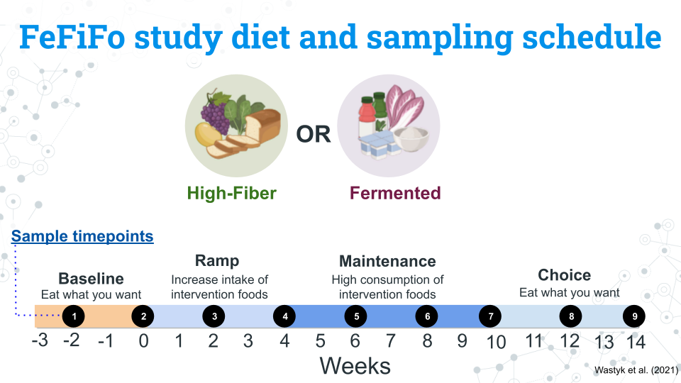
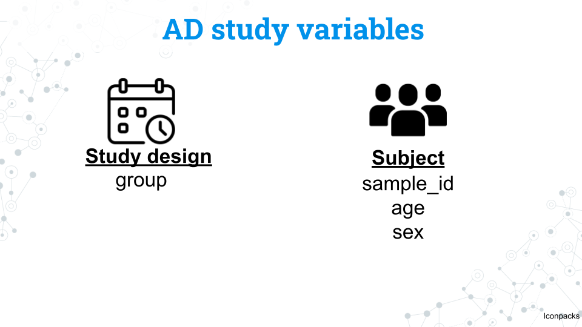

# Additional Datasets

### The FeFiFo Study

You have probably heard that some fermented foods like yogurt and cheese contain bacteria that help support a healthy gut. Likewise, fiber is known for positively impacting digestion (though you can also have too much of all of these foods).

Wastyk et al. (2021) explored these foods further in their study [*Gut-microbiota-targeted diets modulate human immune status*](https://www.cell.com/cell/fulltext/S0092-8674(21)00754-6?ref=podcastdisclosed.com)
We call this the FeFiFo study because the experimental design includes fermented and fiber-rich food treatment groups.

The researchers examined effect of either high fiber (n=18) or fermented foods on the gut microbiome (n=18). Rather than controlling diet entirely through standardized portions, participants were allowed to select what foods they ate so long as these foods were high in fiber or were fermented. Additional metadata was collected from participants including ethnicity, relationship status, employment status, and education level. Similarly to the MISO study, participants had a baseline diet before switching to an intervention diet and finally returned to being allowed to eat whatever they wanted. 

#### Some questions to get you started

- How variable is the change of microbiome composition and alpha diversity across individuals? Do all individuals change the same amount or are there some individuals much more sensitive to their chosen food group?
- What are the most abundant microbes in each treatment (fiber, fermented)? Are they similar taxa or different?
- Is there any relationship between ethnicity, education, employment, relationship status and microbiome composition and/or alpha diversity?
- Are the subject’s microbiomes at a given timepoint similar to each other? Similar to other samples from the same subject no matter the timepoint?

### Alzheimer's dataset

Our body requires our organs working in tandem and communicating with each other in order to function. One of the key relationships you may have heard of is the gut-brain axis, a bidirectional relationship between the gastrointestinal system and the central nervous system. 

To explore this relationship within the specific context of a disease, we have a dataset from [*Gut microbiota is altered in patients with Alzheimer’s disease* by Zhuang et al. (2018)](https://journals.sagepub.com/doi/abs/10.3233/JAD-180176). This dataset was selected by a student from Clovis Community College and integrated into our curriculum! In this study researchers sequenced the gut microbiome from 43 patients with Alzheimer's disease and 43 patients from age and sex matched controls. The metadata is more sparse than our other datasets, but a wealth of taxonomic information remains unanalyzed!

As computational methods and biological databases have advanced in the nearly decade since, we reanalyzed the raw data from this study with a more recent database (SILVA 138.2). As such, you may find that your results are drastically different from the original study, and its possible that changes in our understanding of microbiology and the processed data may lead us to draw different conclusions than the original authors.

#### Some questions to get you started

- How similar are microbiomes between healthy and AD individuals in composition and/or alpha diversity?
- Looking at other published research studies, are the microbial taxa associated with AD also found in this study?
- Select a microbial taxa of interest (perhaps from the idea above) and explore it at increasing levels of resolution up to the level of species. Looking at other published research studies, what functions are these taxa associated with? Do they have any relation to AD or other neurodegenerative diseases?

### Footnotes

#### Resources

- [16S miniCURE Guide](https://science.c-moor.org/miniCURE-16S-Microbiome/s-minicure-guide.html)
- [Wastyk et al. 2021](https://www.cell.com/cell/fulltext/S0092-8674(21)00754-6?ref=podcastdisclosed.com)
- [Zhuang et al. 2018](https://journals.sagepub.com/doi/abs/10.3233/JAD-180176)

#### Contributions and Affiliations

- Sayumi York, Notre Dame of Maryland University

Last Revised: June 5, 2026
