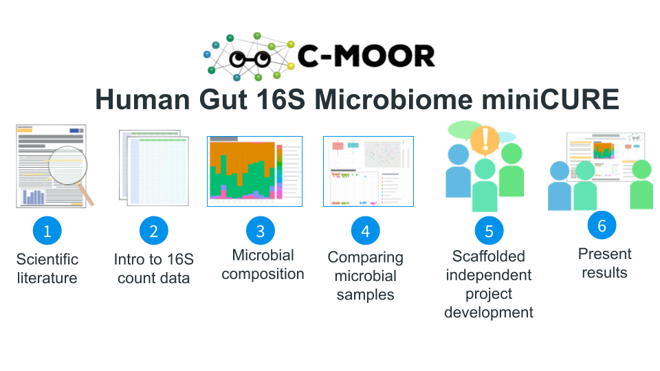

# About this Course {-}

This miniCURE has students design an independent research project around a question relating to the human gut microbiome. As they build their project, students will describe microbes using different taxonomic ranks, find and read scientific literature, and think about how community composition, biodiversity, and specific microbes can differ between samples. Finally, students will practice the scientific process to test their own question about the gut microbiome from their chosen dataset.

### Skills Level {- .unlisted}

::: {.notice}
_Genetics_  
**Novice**: Foundational understanding of [prokaryotes and their relationships with hosts](https://openstax.org/books/biology-2e/pages/22-introduction)

_Programming skills_  
**Novice**: No programming experience needed
:::

### Learning Goals {-}

- **Find and read scientific literature** to interact with the greater scientific community and build an epistemological identity
- **Analyze data (i.e. create and interpret plots)** to generate novel conclusions and new lines of inquiry based on previous findings.
- **Cultivate an “-omics” perspective**, to identify the advantages of genomic science for large datasets and connect findings to biological insights
- **Practice the scientific process**, identifying avenues for research, designing experiments, analyzing data, and integrating results into the broader scientific discourse.

### Core Competencies {- .unlisted}

This activity addresses several core concepts and competencies from the following sources:

  - [Vision and Change in Undergraduate Biology Education](https://visionandchange.org/) AAAS report
  - [Bioinformatics core competencies for undergraduate life sciences education](https://doi.org/10.1371/journal.pone.0196878) by [NIBLSE](https://qubeshub.org/community/groups/niblse)

See [Appendix](#competencies-table) for details.

