# Introduction

## C-MOOR miniCURE Overview


### What is C-MOOR?

C-MOOR is a project to invite students to join the data science revolution and be part of the next generation of data scientists. This project provides online materials to help students and instructors incorporate authentic research experiences in lower division courses. 


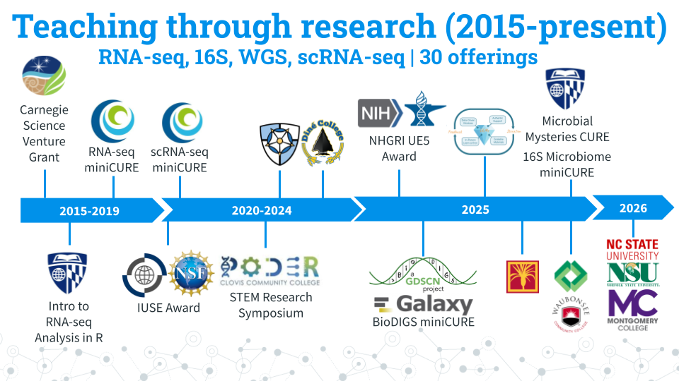


Over the years, C-MOOR has expanded its curricula to include RNA-seq, scRNA-seq, 16S amplicon sequencing, and WGS modules. Here's some statistics about C-MOOR students:

- **Students taught:** 950+. 
- **90% of our students are first years:** We break the myth that only advanced-level students can perform and excel in real research. 
- **Student research posters:** 100+. We choose a poster as our final deliverable to facilitate participation in research symposiums. Posters also allow us to evaluate the efficacy of our curricula over the years and make it easy for instructors to quickly and objectively grade student work. You can see a handful of posters [here](https://help.c-moor.org/c/look-at-this/8)!
- **50% + Students choose to present posters at optional symposiums:** C-MOOR posters have served as the impetus for establishing a new research symposium at Clovis Community College. Our students have attended and won awards at their institution's research days and at conferences such as GRADS-4C and the ASM Maryland Branch Meeting.

### Why data science?
Data Science is an evolving career path for individuals (data scientists) in fields that need to manipulate large amounts of data. The job of a Data Scientist was called by the Harvard Business Review "[the sexiest job of the 21st century](https://hbr.org/2012/10/data-scientist-the-sexiest-job-of-the-21st-century)" Data Scientists are individuals with a curiosity to look through data, identify patterns and develop testable hypotheses.  In the Biological Sciences, data scientists dig through data to answer questions about health, disease, evolution, ecology, drug development, and much more. A currently relevant example is compiling and looking at the similarities and differences between the different SARS-CoV-2 strains and identify differences between strains that may lead to differences in rates of infection.


### Learning Goals

1. Engage with real and current scientific data
1. Explore available research resources online
1. Recognize the interdisciplinary nature of biological sciences
1. Synthesize findings from scientific literature
1. Summarize findings and discuss results with your peers
1. Collaborate with peers on a data exploration activity

## The Scientific Process

*Estimated time: 30 min*

Watch this 10 min video and answer the questions below.


[[video](https://www.youtube.com/watch?v=5kcAc20Bus8)][[slides](https://docs.google.com/presentation/d/1zWWdJcJUgp1mXoTE7d0V-7T9ft_Y1EmV0P3VEzWsAXs)]

Describe the key aspects of each of the following elements of the scientific process:

1. Exploration and Discovery
1. Testing Ideas
1. Community Analysis and Feedback
1. Benefits and Outcomes

Learn more at [Understanding Science 101](https://undsci.berkeley.edu/understanding-science-101/how-science-works/exploration-and-discovery)


<!-- ```{r, echo=FALSE, results='asis'} -->
<!-- cow::borrow_chapter( -->
<!--   doc_path = "docs/02-chapter_of_course.md", -->
<!--   repo_name = "jhudsl/OTTR_Template" -->
<!-- ) -->
<!-- ``` -->

<!-- SciServer -->


<!-- Set up code of OTTR Book-->


## SciServer Onboarding

### Join SciServer


#### Purpose

Students will create a SciServer account and be added to a SciServer by their instructor, which gives them access to the images and data needed to access learning modules and complete their research project. **The steps in this section only need to be completed once.**

#### Learning Objectives

1. Create an account on SciServer
1. Confirm your email address
1. Share your username with your instructor
1. Confirm your access to class materials on SciServer

This video ([video](https://link.c-moor.org/video-join-sciserver))([slides](https://docs.google.com/presentation/d/1kxbnBLoRsdPW4ZkjwNsAHS1XFPuJpQZ8I1aVqyZISW0)) shows you how to create a SciServer account. You can follow along with the video, or follow the steps below.

#### Introduction

SciServer is an online platform for doing scientific data analysis. It is used by scientists studying astronomy, biology, oceanography, and more, and is free as long as you are using it for scientific research. Using SciServer means you do not need a fancy computer or need to install any special programs on your computer, you can just log in with your internet browser to start doing research.  For this course, we have set up SciServer with customized collections of programs for RNA-seq analysis, as well as the data that we’ll be analyzing.  Once you sign up for SciServer and are added to the group for this course, you will be able to access these tools and begin your data analysis journey!

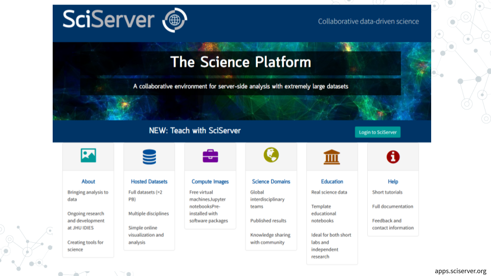


#### Part 1 -- Create an account on SciServer

1. Open [sciserver.org](https://www.sciserver.org/) in a web browser
    a. It is a good idea to bookmark this page so that you can easily access it throughout the course.
1. Click “Login to SciServer”
1. Click “Create a new account”
1. Enter a User name, Email, etc. and click “Create account”
    a. Note that you cannot change your username once you have made your account

#### Part 2 -- Confirm your email address

1. **Important!**: Click the verification link in your email inbox.
    a. If you do not verify your account you will get locked out and will need to contact your instructor to unlock your account.
    a. If you do not see an email, try checking your spam folder.
1. After clicking the verification link, confirm that your username appears in the upper right hand corner.


#### Part 3 -- Share your username with your instructor

Refer to your instructor on how to share your username with them. Your instructor will add you to a group that will give you access to all the necessary resources. 

1. Share your username with you instructor and await invitation to the SciServer group

#### Part 4 -- Accept the invitation to join a SciServer group

This video ([video](https://link.c-moor.org/video-join-sciserver-group))([slides](https://docs.google.com/presentation/d/1codot9UeUO7l0EDcEre7dJgyXurD_xyxpw6IJL_aEjM)) shows you how to join a SciServer group.  You can follow along with the video, or follow the steps below.

1. Open [sciserver.org](https://www.sciserver.org/) in a web browser and log in to your account.
1. Click “Groups”
1. On the left, you should see a list of all the groups you have joined or been invited to.  Click on the name of the group for this course, then click “Accept invitation”.
    a. Your instructor must have your username to invite you to the group.  If you do not see an invitation, contact your instructor with your SciServer username.
1. Confirm that you can access course data
    a. On the top menu bar, click “Files”
    a. On the left-hand menu, click “Data Volumes”
    a. Confirm that you see “C-MOOR-Data”
1. Confirm that you can access course computing resources
    a. Click “Home” in the top menu to return to the home page.
    a. Scroll down to the second set of boxes and click “Compute”
    a. Click “Create container”
    a. In the “Compute Image” drop-down menu, confirm that you can see “C-MOOR LearnR” and “C-MOOR R-Studio”
    a. Under “Data Volumes”, confirm that you can see “C-MOOR Data”
    a. You can close the Create Container dialog box (by clicking the “X” in the top right) once you’ve confirmed that you can see the C-MOOR content


#### Troubleshooting

- Some students have had issues signing up or logging into SciServer but were successful at a later date/time. We suggest giving students time to sign up well in advance of their first module on SciServer in case of technical difficulties.

#### Footnotes

##### Contributions and Affiliations

- Katherine Cox, Johns Hopkins University
- Frederick Tan, Carnegie Institution
- Sayumi York, Notre Dame of Maryland University

Last Revised: June 5, 2026


### Running modules on SciServer

#### Purpose

The purpose of this assignment is to learn how to access the modules for your course on SciServer and properly close out your session when finished.

#### Learning Objectives

1. Start up a C-MOOR LearnR compute container
1. Access a C-MOOR module
1. Delete your C-MOOR LearnR compute container when finished

#### Introduction

Before beginning this assignment, you should have already created a SciServer account and submitted your SciServer username to your instructor.  In this assignment you will learn how to set up a “compute container” on SciServer. Compute containers are how you use programs on SciServer.  There are two C-MOOR compute containers on SciServer: “C-MOOR LearnR” has tutorials that will teach you how to run data analyses, and “C-MOOR R-Studio” is where you can work on your own data analysis projects.  This assignment shows you how to set up the C-MOOR LearnR compute container and start up your first tutorial.

#### Part 1 -- Start up a “C-MOOR LearnR” compute container

This video ([video](https://link.c-moor.org/video-sciserver-create-learnr-container))([slides](https://docs.google.com/presentation/d/1Oaq8RzhaDANxkNh-tTKwme7e095pGgoiq5iZHbt7PLg)) shows you how to create and start up a C-MOOR LearnR compute container.  You can follow along with the video, or follow the steps below.

1. Open [sciserver.org](https://www.sciserver.org/) in a web browser and log in to your account.
    a. If you are already logged in, click “Home” in the top menu to return to the home page.
1. Scroll down to the second set of boxes and click “Compute”
1. Click “Create container”
    a. Give your container a name.  This can be anything you like, but it’s useful if it says something about the purpose of the container so you can tell your containers apart.  You could name this container “Tutorials”, since you’ll be using it to access tutorials.
    a. In the “**Compute Image**” drop-down menu, select the <mark>**C-MOOR LearnR that your instructor chooses**</mark>
    a. Under “**Data Volumes**”, check the box next to “**C-MOOR Data**”
    a. Click “Create”.  This may take a moment.
1. You should now see a new entry in your list of containers
    a. “Created At” should be a few moments ago.
    a. “Name” should be the name you chose
    a. “Image” should be “C-MOOR LearnR”
1. Start your C-MOOR LearnR container by clicking on its name (whatever name you chose when you created it).  This will open in a new tab.
    a. You should see a list of tutorials, organized by topic.


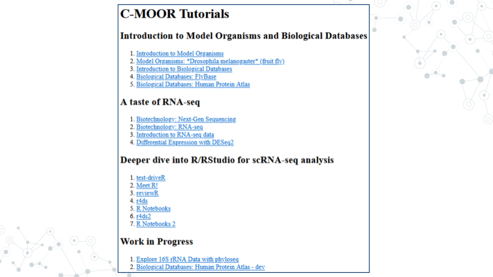

a. If instead you see an error message, you most likely forgot to check the box next to “C-MOOR Data” when you created the container.
  
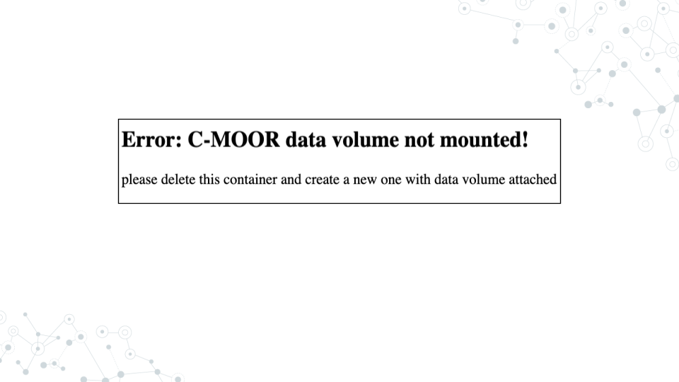

a. If you see something else, you may have picked the wrong “Compute Image” from the drop-down menu.

**If anything goes wrong, you can always delete your container by clicking the red “X” in the last column, and create a new container.**

##### Resources

- [sciserver.org](https://www.sciserver.org/)
- [Get help with SciServer on the C-MOOR Discourse](https://help.c-moor.org/c/help/)

#### Part 2 -- Opening C-MOOR modules

1. If you’re not there already, go to the SciServer compute page and start up the C-MOOR LearnR container.
    a. Open [sciserver.org](https://www.sciserver.org/) in a web browser and log in to your account.
    a. If you are already logged in, click “Home” in the top menu to return to the home page.
    a. Scroll down to the second set of boxes and click “Compute”.
    a. Start your C-MOOR LearnR container by clicking on its name.
1. Click on the module chosen by your instructor.  The tutorial will open in a new tab.
1. Complete the tutorial.

##### Resources

- [sciserver.org](https://www.sciserver.org/)
- [Get help with SciServer on the C-MOOR Discourse](https://help.c-moor.org/c/help/)

#### Part 3 -- Delete your C-MOOR LearnR compute container

Compute containers are meant to be temporary, and you can only have 3 containers total on SciServer.  So it’s generally a good idea to clean up after yourself and delete your containers when you’re done using them.  Also, if any updates are made to the C-MOOR LearnR container, **you will need to create a new container to get the latest updates.**

**Deleting your container will delete your progress in a tutorial**, so don’t delete the container until you have completed the tutorial and submitted any required items to your instructor.

To delete a container:

1. If you’re not there already, go to the SciServer compute page.
    a. Open [sciserver.org](https://www.sciserver.org/) in a web browser and log in to your account.
    a. If you are already logged in, click “Home” in the top menu to return to the home page.
    a. Scroll down to the second set of boxes and click “Compute”.
1. Find the container you want to delete.
1. Click on the red “X” in the last column.

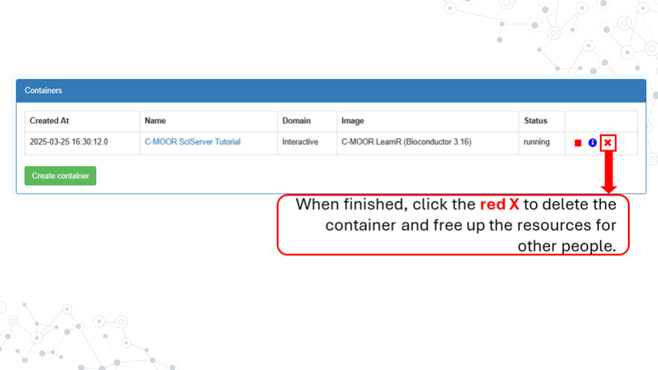

##### Resources

- [sciserver.org](https://www.sciserver.org/)
- [Get help with SciServer on the C-MOOR Discourse](https://help.c-moor.org/c/help/)

#### Footnotes

##### Contributions and Affiliations

- Katherine Cox, Johns Hopkins University
- Frederick Tan, Carnegie Institution
- Sayumi York, Notre Dame of Maryland University

Last Revised: June 5, 2026
<!-- AnVIL -->


<!-- Set up code of OTTR Book-->


## AnVIL Onboarding

### Join AnVIL

#### Purpose

You will need an account on AnVIL in order to use the platform. In this section we'll go over the specifics of account creation.  

#### Learning Objectives

1. Create an account on AnVIL
1. Login to AnVIL
1. Share the email you used to sign up for AnVIL with your instructor (if applicable)

#### Introduction

AnVIL (The Genomic Data Science **An**alysis, **V**isualization, and **I**nformatics **L**ab-space) is a platform created by the National Human Genome Research Institute (NHGRI) in collaboration with cloud computing platform providers like Google and Microsoft. Using AnVIL we can access computing resources on the cloud through your browser without need for any fancy physical equipment. Through AnVIL you will also have access to all the software and data necessary to complete your research project. 

In this section, we will set up our accounts on AnVIL and go through the entire lifecycle of an RStudio environment from creation to deletion. You will repeat this process throughout the semester; feel free to refer back to this section if you need a refresher on how to use AnVIL.

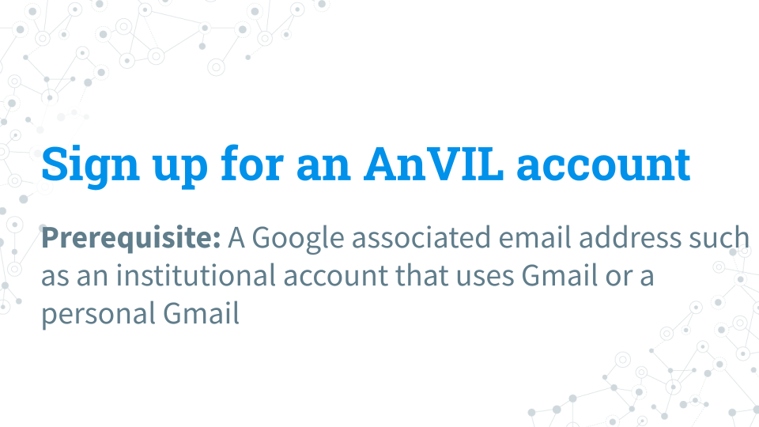

#### Part 1 -- Create an account on AnVIL

Follow the written steps below or refer to the [slides](https://docs.google.com/presentation/d/1uwlG7uaTOnItdpd4Ll6nNQiBJKBivsvR-erupicAwJM/edit?usp=sharing) or video guide.


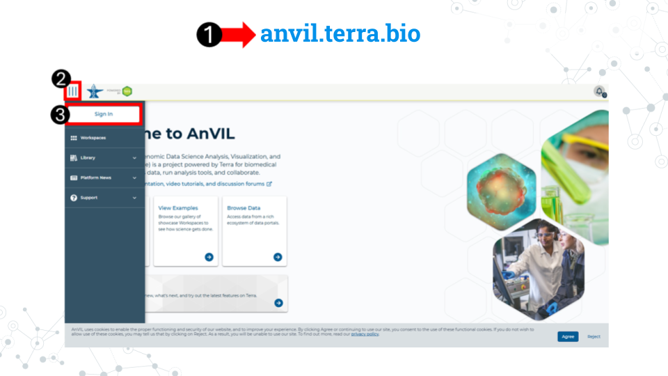

1. Open [anvil.terra.bio](https://anvil.terra.bio/) in <mark> **Google Chrome** </mark>. Google Chrome is the only officially supported web browser for AnVIL. Because of this, while you can run AnVIL in other browsers you strongly suggest using Chrome.
    - Tip: bookmark this page so that you can easily access it throughout the course.
1. Click the hamburger icon (3 lines) in the top left corner of the screen 
1. Click "Sign in"


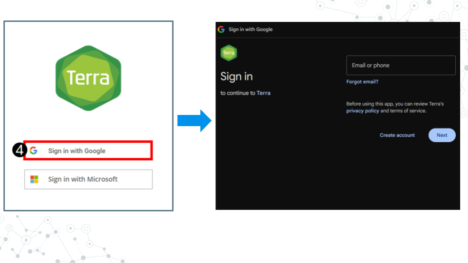

4. Click "Sign in with Google".
5. Sign in with a <mark>**Google associated email address**</mark> such as an institutional email that uses Gmail or a personal Gmail account. You must use a Google associated email address to gain access to Google Cloud computing resources. 
6. If you are a student, share the email you used to sign up for AnVIL with your instructor following their instructions.

<mark>**Instructors should collect the student emails and use them in the next section, "Setting up workspaces on AnVIL." Students do not need to set up a workspace, and should proceed to the section, "Running a module on AnVIL".**</mark> 

##### Resources

- [AnVIL](https://anvil.terra.bio/) 
- [How to add a bookmark in Chrome](https://support.google.com/chrome/answer/188842)
- [AnVIL support home](https://support.terra.bio/hc/en-us)


### Running a module on AnVIL
<!-- change fig.align quotes from single to double -->
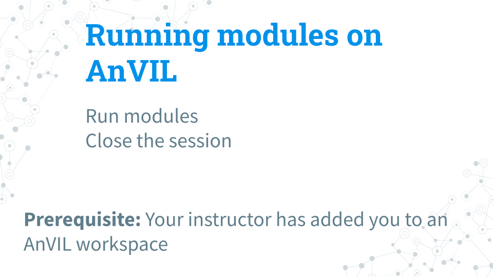

#### Purpose

In this section we will go over how to run C-MOOR modules on AnVIL. We will go over how to create an RStudio environment in that workspace to run the module and properly end a session on AnVIL to prevent runaway costs.

#### Learning Objectives

1. Launch a module through the cloned workspace
1. Close out a session on AnVIL properly to prevent runaway costs

#### Introduction

Before beginning this assignment, you should have already created an AnVIL account and submitted the email you used to sign up for AnVIL to your instructor. In this assignment you will learn how to setup an RStudio environment on AnVIL. This environment is analogous to preparing a lab space for a physical lab. You have to have the right equipment and reagents to be able to do the activity. 

This assignment shows you how to set up the RStudio environment and start up your first C-MOOR tutorial.

#### Part 1 -- Confirm you have access to your class workspace

The workspace is the heart of AnVIL. To be able to run modules, you need to have access to the class workspace. Here are some key points about workspaces:

- Every workspace comes with its own Google Bucket (our cloud storage). Your bucket will be empty.
- Every workspace has its own billing project. Students who are not yet associated with a billing project will not be able to compute on their workspace.
- We can control access levels of users and set them either as owners, writers, or readers. Students will be writers with compute access.

The workspace is the heart of AnVIL. 

1. Open [AnVIL](https://anvil.terra.bio/) in Google Chrome
1. Click on the hamburger icon in the top left corner
1. Login to your AnVIL account
1. Click on the hamburger icon in the top left corner again
1. Click workspaces
1. Confirm you see your class workspace
1. Click on the workspace name to enter the workspace.

##### Resources

- [AnVIL](https://anvil.terra.bio/) 
- [Get help with AnVIL on the C-MOOR Discourse](https://help.c-moor.org/c/help/)

#### Part 2 -- Start access a module

When you open the workspace, you will be on the dashboard tab by default. The dashboard contains the instructions on how to use the workspace, links to C-MOOR websites, and the startup script. Let’s try running a module.

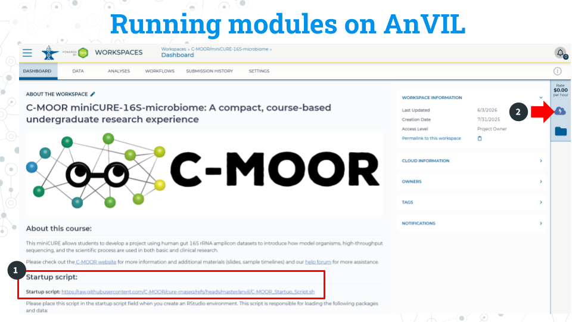

1.  Copy the URL of the startup script. Make sure there are no spaces before or after what you copy. This script is held in the original workspace everyone cloned. You will need to input this URL soon.

2. Click on the Environment Configuration button, the cloud with a thunderbolt.

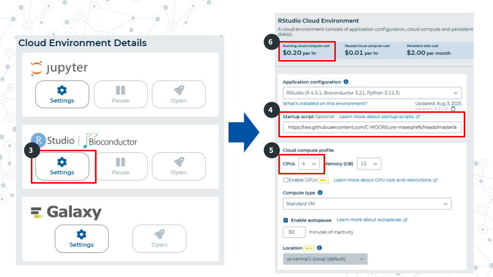

3. In the RStudio section, click Settings

4. In the startup script field, paste the URL for the startup script. 

5. Select 4 CPUs and 15 gigabytes of memory.

6. Confirm that the cloud compute cost is 20 cents per hour. If it is not 20 cents per hour, reselect CPUs and memory allocation in step 5 This is a known bug in AnVIL at the writing of this guide.

7. Scroll to the bottom of the window and click “Create”. It will take about 2 minutes for the environment to be created.

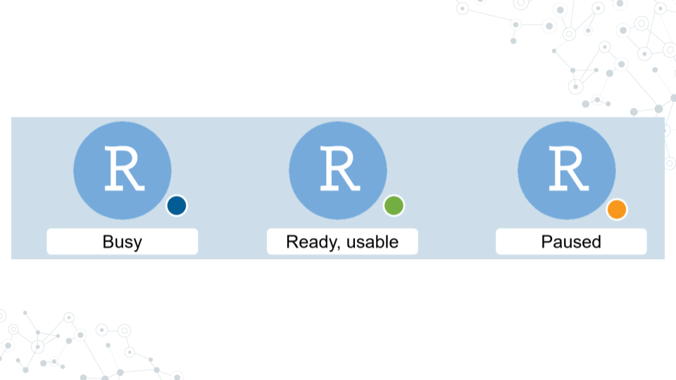

It will take some time for the RStudio Environment to be created. You can keep track of the status of the environment based on the colored dot next to the RStudio icon. The dot will turn green when the environment is ready. While it is loading (blue), you cannot interact with it.

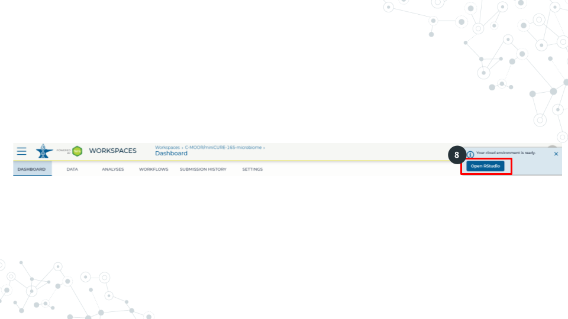

8. When the environment is ready, use the Open RStudio button that will pop up. If you hold down Ctrl as you click, you can open RStudio in a new window.

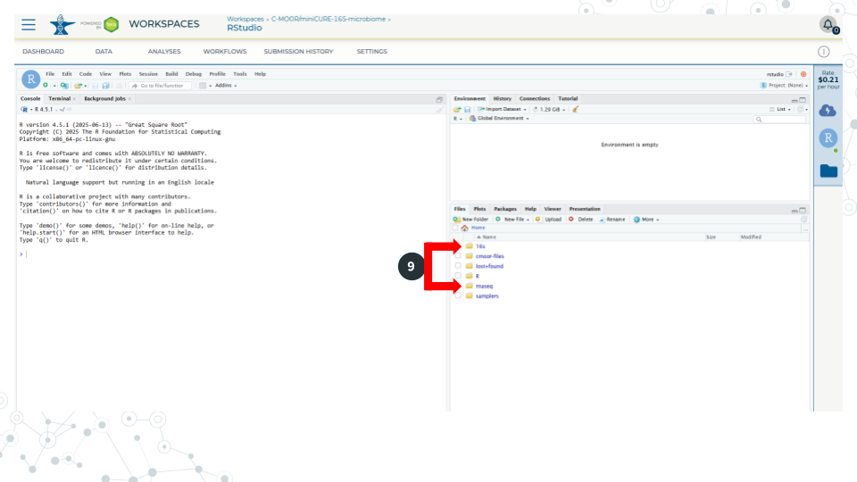

9. Use the file explorer in RStudio to navigate to your module of choice. First, enter the folder of the curriculum you are using, either rnaseq (not cure-rnaseq) or 16s. Then enter the folder of the module you want to run. 

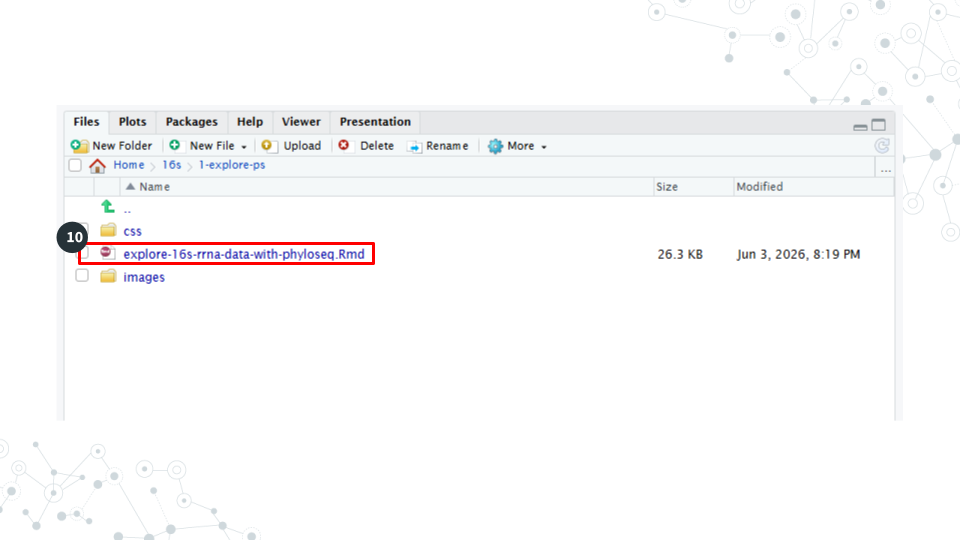

10. In the module’s directory, open the .Rmd file by double clicking its name.

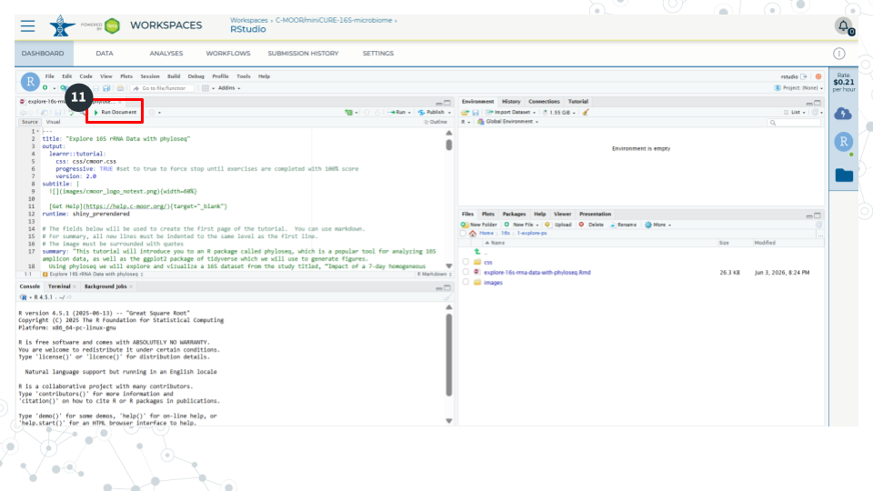

11. Click Run Document in the open .Rmd file

<mark>**When you are finished, make sure you close out your session properly to prevent runaway costs!**</mark>. 

##### Resources

- [AnVIL](https://anvil.terra.bio/) 
- [Get help with AnVIL on the C-MOOR Discourse](https://help.c-moor.org/c/help/)

#### Part 3 -- Closing out a session on AnVIL


1. On the right side of the screen, click the Cloud Environment button. This is the Cloud with the lightning symbol.
1. Under the RStudio section, click settings.
1. Scroll to the bottom of the new window and click delete environment.
1. Check <mark>**Delete everything, including the persistent disk or your instructor's billing account will incur costs for storage**</mark>. 

##### Resources

- [AnVIL](https://anvil.terra.bio/) 
- [Get help with AnVIL on the C-MOOR Discourse](https://help.c-moor.org/c/help/)

#### Footnotes

##### Contributions and Affiliations

- Sayumi York, Notre Dame of Maryland University

Last Revised: June 5, 2026
